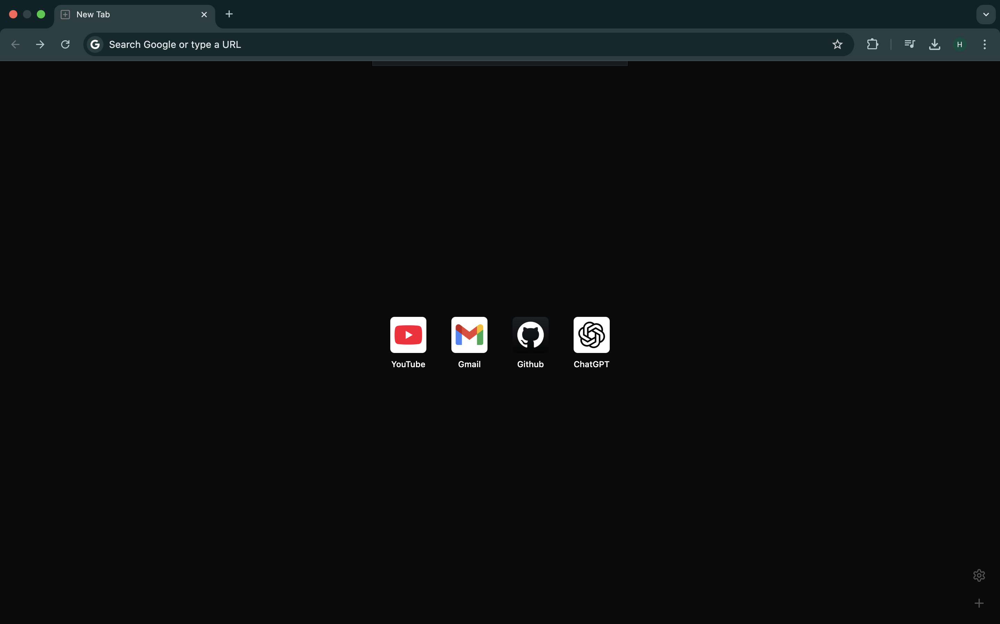

# Startpage frontend


A customizable Chrome and Firefox startpage extension with automatic links favicon fetching and additional usability and personalization features.



## Features

- **🔗 Link Previews** – Displays favicons.

- **📌 Drag & Drop Links** – Easily organize your links.

- **🖼️ Custom Background** – Personalize with your own image.

- **📐 Adjustable Grid Layout** – Modify link column count.

- **🎨 Auto Contrast Labels** – Ensures readability on any background.

- **🌗 Light & Dark Mode Switching** – Seamlessly toggle between light and dark themes

## Installation & usage

1. Install pnpm (package manager)

   https://pnpm.io/installation

2. Build static assets

   ```sh
   pnpm install
   pnpm build
   ```

### For Chrome

3. Load the Extension in Chrome

   1. Open **Chrome** and navigate to `chrome://extensions/`
   2. Enable **Developer mode** (top-right corner)
   3. Click **Load unpacked** and select the `dist` folder

### For Firefox

3. Load the Extension in Firefox

   1. Open **Firefox** and navigate to `about:debugging`
   2. Click **This Firefox**
   3. Click **Load Temporary Add-on**
   4. Select any file from the `dist` folder


## Stack

Vite, React, TypeScript, Tailwind v4, Dnd-kit, React hook form, Zod
